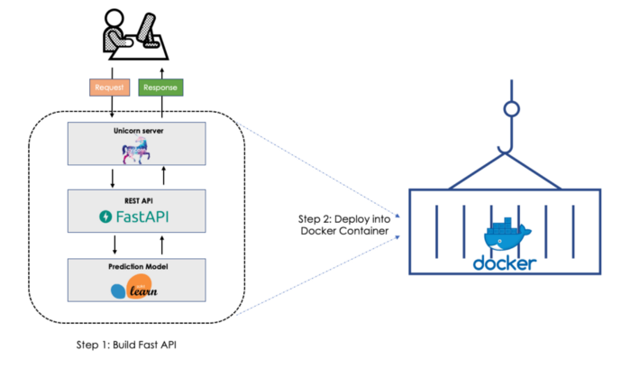

# ML-FastAPI-Docker

A dummy Machine Learning application as a template using FastAPI, a high-performance framework for RESTful microservices, and Docker that makes the API portable and able to run uniformly and consistently across any platform (including the cloud).

Image created by [Zoumana Keita](https://zoumanakeita.medium.com/about).

## Setup
* `git clone https://github.com/okamiRvS/ML-FastAPI-Docker.git`
* `cd ML-FastAPI-Docker`
* `docker build -t fastapiapp:latest -f docker/Dockerfile .`
* `docker run -p 80:80 fastapiapp:latest`
* Connect to `http://0.0.0.0:80/docs`